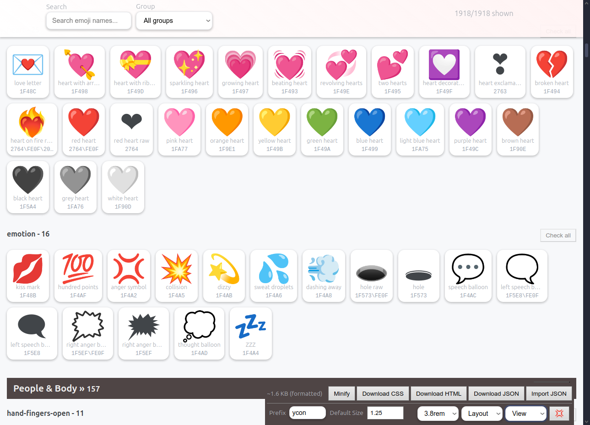
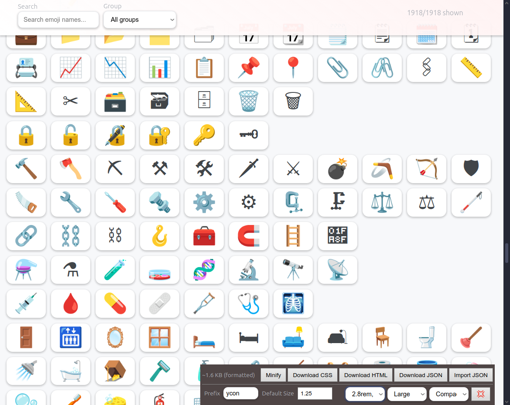

# Ycons - Emoji Icon Generator 🎨

**Icons for WebApps using Emojis** - A powerful browser-based tool for creating custom CSS icon systems using Unicode emojis.

This tool is completely self-contained HTML that runs instantly and offline in any modern browser, just using the `file://` protocol. All CSS and JavaScript are embedded - no external dependencies, no build steps, no server needed. You can download and run it from your download folder.

> **1,918 Unicode symbols available - 140,000+ possible thanks to Unicode's vast character set**
>
> 140,000 icons ~= 8MB CSS plus a lot of fun while browsing them searching the right one.

You may recognize some of these icons. These are the same icons used by LLMs and AI Assistants across the world.

```
🚀 ✨ 💪 ❤️ ⚡ 🔥 🎯 🏆 👑 💎 ⭐ ✅ ❌
⚠️ ℹ️ 🔒 👁️ 🔍 ⚙️ 🔔 ⬆️ ⬇️ ⬅️ ➡️ 🏠 📁
📄 🗑️ 💬 📞 🎵 🌙 ☀️ ⏰ 💰 🧠 🎨 🌍 📈
```

**Ycons gives you all 1,918 symbols** with familiar CSS classes (`.ycon-rocket`), plus powerful extras:

- **Transform utilities** - flip, mirror, rotate in any direction
- **Filter effects** - grayscale, brightness, blur, sepia
- **Animations** - spin, pulse, bounce with smooth CSS keyframes
- **Size variants** - 7 different sizes from tiny to huge (xxs → xxl)

All while maintaining the **ultra-lightweight** approach that beats every icon library.


## Preview

That's what to expect: Plain CSS. You can copy&paste it to your HTML, or download the generated CSS as file and link it to your HTML.

**No additional files, images, svgs, pngs, apis, endpoints, packages or else needed.**



The final icons are plain CSS, so basically text - no external files or tools needed! You can copy&paste it to your `main.css` and it will work.


[Live example for the following on JSFiddle using: 😀](https://jsfiddle.net/zsoepy1f/)

But instead of the Emoji itself, we use Unicode identifiers (e.g., "\1F600"). That's the safest way to deliver Unicode character in CSS for most browsers.

~~`.ycon-flexed-biceps::before { content: "\1F600"; }`~~

Renamed to (you can rename all, or none, it's your call):

`.ycon-ypsilon::before { content: "\1F600"; }`

```html
<!--
  General styles for Ycons - 😀

  This is the generated CSS Structure (copy&pasted):
-->
<style>
.ycon {
  display: inline-block;
  vertical-align: middle;
  line-height: 1;
  font-size: 1.25rem;
  pointer-events: none;
  user-select: none;
}
.ycon::before { display: inline-block; }

/* Transform utilities */
.ycon.mirror { transform: scaleX(-1); }
.ycon.flip { transform: scaleY(-1); }
.ycon.mirror.flip { transform: scale(-1, -1); }
.ycon.rotate-90 { transform: rotate(90deg); }
.ycon.rotate-180 { transform: rotate(180deg); }
.ycon.rotate-270 { transform: rotate(270deg); }

/* Filter utilities */
.ycon.gray { filter: grayscale(1); }
.ycon.blur { filter: blur(1px); }
.ycon.dim { filter: brightness(0.7); }
.ycon.bright { filter: brightness(1.3); }
.ycon.sepia { filter: sepia(1); }
.ycon.invert { filter: invert(1); }
.ycon.saturate { filter: saturate(1.5); }
.ycon.desaturate { filter: saturate(0.5); }

/* Animation utilities */
.ycon.spin { animation: ycon-spin 2s linear infinite; }
.ycon.pulse { animation: ycon-pulse 2s ease-in-out infinite; }
.ycon.bounce { animation: ycon-bounce 1s ease-in-out infinite; }

/* Keyframes */
@keyframes ycon-spin {from {transform: rotate(0deg);} to {transform: rotate(360deg);}}
@keyframes ycon-pulse {0%, 100% {opacity: 1;} 50% {opacity: 0.5;}}
@keyframes ycon-bounce {
  0%, 20%, 50%, 80%, 100% { transform: translateY(0); }
  40% { transform: translateY(-10px); }
  60% { transform: translateY(-5px); }
}

/* Size variants */
.ycon-xxs { font-size: 1rem; }
.ycon-xs { font-size: 1.25rem; }
.ycon-sm { font-size: 1.5rem; }
.ycon-md { font-size: 1.75rem; }
.ycon-lg { font-size: 2rem; }
.ycon-xl { font-size: 2.5rem; }
.ycon-xxl { font-size: 3rem; }

/*
 * Ycons go here. You can add new Ycons using revolutionary copy&paste.
 */
.ycon-ypsilon::before { content: "\1F600"; }

/* 💡 Fun fact:
  Ycons works with ANY Unicode character! Need an ampersand (&) or custom symbol?

  .ycon-ampersand::before { content: "\0026"; }  // \0026 = & symbol
  .ycon-heart::before { content: "\2665"; }      // \2665 = ♥ heart

  Find UTF-16 codes at: https://www.compart.com/en/unicode/
*/
</style>
<!--

  * Available variants, including sizes and modifiers.
  * This is not part of the tool, but how to use Ycons.

-->
<span class="ycon ycon-ypsilon"></span>
<span class="ycon ycon-ypsilon ycon-xxs"></span>
<span class="ycon ycon-ypsilon ycon-xs"></span>
<span class="ycon ycon-ypsilon ycon-sm"></span>
<span class="ycon ycon-ypsilon ycon-md"></span>
<span class="ycon ycon-ypsilon ycon-lg"></span>
<span class="ycon ycon-ypsilon ycon-xl"></span>
<span class="ycon ycon-ypsilon ycon-xxl"></span>
<hr />
<span class="ycon ycon-ypsilon gray"></span>
<span class="ycon ycon-ypsilon dim"></span>
<span class="ycon ycon-ypsilon bright"></span>
<span class="ycon ycon-ypsilon sepia"></span>
<span class="ycon ycon-ypsilon invert"></span>
<span class="ycon ycon-ypsilon saturate"></span>
<span class="ycon ycon-ypsilon desaturate"></span>
<span class="ycon ycon-ypsilon blur"></span>
<span class="ycon ycon-ypsilon mirror"></span>
<span class="ycon ycon-ypsilon flip"></span>
<span class="ycon ycon-ypsilon rotate-90"></span>
<span class="ycon ycon-ypsilon spin"></span>
<span class="ycon ycon-ypsilon pulse"></span>
<span class="ycon ycon-ypsilon bounce"></span>
```

[Live demo with 131 icons (~8kb CSS) on JSFiddle](https://jsfiddle.net/wycsx647/)
- The size of the final CSS is also pretty constant and predictable (Unicode identifier, editable names)

## 🔄 Creative Loading Indicators

Spinning emojis make perfect themed loading indicators with personality:

```html
<!-- Classic spinners -->
<span class="ycon ycon-gear spin"></span>           <!-- ⚙️ Processing... -->
<span class="ycon ycon-cyclone spin"></span>        <!-- 🌀 Loading... -->
<span class="ycon ycon-arrows-counterclockwise spin"></span> <!-- ↺ Refreshing... -->

<!-- Creative themed loaders -->
<span class="ycon ycon-pizza spin"></span>          <!-- 🍕 Cooking your data -->
<span class="ycon ycon-cd spin"></span>             <!-- 💿 Loading playlist -->
<span class="ycon ycon-camera spin"></span>         <!-- 📷 Processing photos -->
```

**Pro tip:** Combine animations for extra attention (not included):
```html
<style>
.ycon.pulse.spin {
  animation:         ycon-pulse 2s ease-in-out infinite, ycon-spin 2s linear infinite;
  -webkit-animation: ycon-pulse 2s ease-in-out infinite, ycon-spin 2s linear infinite;
}
</style>
<span class="ycon ycon-hourglass-flowing-sand spin pulse"></span> <!-- ⏳ Double effect! -->
```

[Interactive loading indicators demo on JSFiddle](https://jsfiddle.net/hmjaw5vb/) | 70 Ycons, ~5,2kb CSS size, no files involved


## 🚀 Quick Start

**✨ [Try Ycons Online](https://eypsilon.github.io/ycons/example/) ✨**
- You can also use the GitHUB page instead downloading the tool, it will always be the latest version.
    - https://eypsilon.github.io/ycons/example/index.html

💪 [Advanced usage examples](https://eypsilon.github.io/ycons/example/advanced.usage.html)

### 📦 Pre-built Downloads

**Don't want to generate your own?** Grab the complete icon set:

- **[All 1,918 icons CSS](./example/downloads/ycons-all.css)** (~101kb formatted)
- **[Minified version](./example/downloads/ycons-all.min.css)** (~89kb minified)
- **[Demo HTML page](./example/downloads/ycons-all.html)** (~2.8MB with live examples and backup JSON)
    - [Browser version](https://eypsilon.github.io/ycons/example/downloads/ycons-all.html)
- **[JSON metadata](./example/downloads/ycons-all.json)** (~292kb with full data)




### 🛠️ Custom Generation

1. Open the live tool or download [`./example/index.html`](./example/index.html) (~290kb)
   - Includes [emoji data](./scripts/emojis.extended.json) (~296kb)
2. Search or browse for emojis you want to use
3. Click emojis to select them
4. See live preview and generated CSS
5. Download your custom CSS file

## ✨ Features

### 🔍 **Live Emoji Browser**
- Browse 1,918 symbols from Unicode emoji set, including custom WebApp symbols
- **Extended symbol set** includes country flags, file-tree icons, and 37+ WebApp symbols (« » ← → ├ └ etc.)
- **Bulk selection tools** - Select entire groups or subgroups with one click
- Real-time search by name, group, or category
- Filter by emoji groups (Smileys, People, Animals, etc.)
- Interactive selection with visual feedback

### 🎛️ **Customizable CSS Generation**
- **Configurable prefix** - Use any CSS class prefix (default: `ycon`)
- **Adjustable default size** - Set base font-size (default: 1.25rem)
- **Size variants** - 7 predefined sizes (xxs to xxl)
- **Transform utilities** - Mirror, flip, rotate transformations
- **Filter effects** - Grayscale, blur, brightness, sepia, invert, saturation
- **Animations** - Spin, pulse, bounce with CSS keyframes

### 📱 **Live Preview**
- Real-time preview of selected icons
- See all size variants and effects instantly
- Toggle effects visibility for cleaner view
- Interactive examples with tooltips

### 💾 **Export & Import**
- **Download CSS** - Get production-ready stylesheet (89-101kb for all icons)
- **Download HTML** - Complete demo page with selected icons (~2.8MB for all icons)  
- **Minify option** - Compact CSS for smaller file sizes (~12% reduction)
- **Export JSON** - Save selected icons with metadata (~293kb for all icons)
- **Import JSON** - Restore previous selections using backup
- **Size calculator** - See approximate CSS size in real-time


## 🎯 Usage Examples

### Basic Icon Usage
```html
<span class="ycon ycon-rocket"></span>
<span class="ycon ycon-heart"></span>
<span class="ycon ycon-star"></span>
```

### Size Variants
```html
<span class="ycon ycon-fire ycon-xs"></span>    <!-- Extra small -->
<span class="ycon ycon-fire ycon-sm"></span>    <!-- Small -->
<span class="ycon ycon-fire ycon-lg"></span>    <!-- Large -->
<span class="ycon ycon-fire ycon-xxl"></span>   <!-- Extra large -->
```

### Transform Effects
```html
<span class="ycon ycon-arrow-right mirror"></span>     <!-- Mirrored -->
<span class="ycon ycon-smiley flip"></span>            <!-- Flipped -->
<span class="ycon ycon-clock rotate-90"></span>        <!-- Rotated 90° -->
```

### Filter Effects
```html
<span class="ycon ycon-camera gray"></span>            <!-- Grayscale -->
<span class="ycon ycon-sun bright"></span>             <!-- Brightened -->
<span class="ycon ycon-crescent-moon dim"></span>      <!-- Dimmed -->
<span class="ycon ycon-old-key sepia"></span>          <!-- Sepia tone -->
```

### Animations
```html
<span class="ycon ycon-gear spin"></span>              <!-- Spinning -->
<span class="ycon ycon-beating-heart pulse"></span>    <!-- Pulsing -->
<span class="ycon ycon-basketball bounce"></span>      <!-- Bouncing -->
```

### Combining Classes
```html
<span class="ycon ycon-rocket ycon-lg spin bright"></span>
```

## 🛠️ Tool Features

### Search & Filter
- **Live search** - Type to find emojis instantly
- **Group filter** - Filter by emoji categories
- **Bulk selection** - Select all icons in groups/subgroups with one click
- **Smart toggle** - Click again to unselect if all icons are already selected
- **Show selected** - View only your chosen icons
- **Smart filtering** - All filters work together

### CSS Customization & Layout
- **Prefix input** - Change CSS class prefix
- **Default size** - Adjust base icon size
- **Layout options** - Multiple width settings (Large, Medium, Small, Smaller)
- **Icon sizes** - Adjustable grid icon sizes (Small, Medium, Large)
- **View modes** - Compact view, group-titles-only for power users
- **Live updates** - See changes immediately
- **Minify toggle** - Switch between formatted/minified CSS

### Preview & Export
- **Live preview** - See exactly how icons will look
- **HTML download** - Generate complete demo pages
- **Size calculation** - Know your CSS file size
- **Fullscreen mode** - Distraction-free editing


## 🌍 Why Unicode Emojis as Icons?

- **Universal**: Unicode emojis are a global standard—natively supported on every modern browser, OS, and device.
- **Familiar**: These are the icons everyone already uses in chat apps, social media, and even AI tools like ChatGPT and GitHub Copilot.
- **Zero Dependencies**: No SVGs, image files, or icon fonts. Just pure CSS and HTML.
- **Recognizable**: Users instantly "get" what each icon means, with no learning curve.
- **Offline-Ready**: Works even on `file://` URLs and in offline environments.

> 💡 **Did you know?**
> The same Unicode emojis you see here are used by large language models (LLMs), messengers, and social apps worldwide. Your users already know these icons!

## 💡 Use Cases

- **Web applications** - Add expressive icons without image files
- **Design systems** - Create consistent emoji-based iconography
- **Prototyping** - Quick icons for mockups and demos
- **Performance** - Lightweight alternative to icon fonts/SVGs
- **Accessibility** - Unicode emojis have built-in semantic meaning

## 🌟 Benefits

- **No dependencies**
    - Ycons: Pure CSS
    - This Tool: Unprecedented
- **Lightweight** - Tiny file sizes compared to icon fonts + no additional files
- **Scalable** - Vector-based emojis scale perfectly
- **Customizable** - Full control over styling and behavior
- **Cross-platform** - Works everywhere Unicode is supported
- **Future-proof** - Based on Unicode standard
- **Thanks to Unicode** - 140,000+ Ycons are a reality
- **Favorite list**
    - Make your selection
    - "Download JSON" with filename "favorite-ycons.json"
    - Import when you need your FAVs

## 🔧 Development

### Processing Emoji Data
```bash
cd scripts/
node parse-emojis.js
```

This processes the Unicode `emoji-test.txt` file into structured JSON data.

## 🚧 Considerations & Limitations

### Platform Rendering Differences
Emojis look different on iOS, Android, Windows, Linux. Your icons aren't visually consistent unless you pair them with a custom emoji font (like Twemoji, Noto Color Emoji). For many projects, that variance is acceptable; for branding-critical ones, consider custom fonts.

### Accessibility Notes
Because these are inserted with `::before { content: "\1F600" }`, screen readers may not announce them correctly. Consider:
- Adding `aria-hidden="true"` to decorative icons
- Providing `role="img" aria-label="icon name"` for semantic icons
- Including text fallbacks for critical UI elements

### Performance vs Icon Libraries
**Ycons advantage:** 150 icons ≤ 10kb vs Font Awesome (~76kb) or Heroicons SVG bundle (~45kb)
- ✅ Faster loading, especially for small icon sets
- ✅ No external dependencies or build steps
- ⚠️ Limited to Unicode characters (140,000+) vs thousands of designed icons

## 💡 Future Enhancements

### Planned Improvements
- **Starter pack**: Pre-built CSS with ~50 most common UI icons (arrows, check, close, warning, info)
- **Accessibility helpers**: Auto-generate `role="img"` and `aria-label` attributes
- **Optional consistency**: Twemoji/Noto Emoji font integration for visual uniformity

### Comparison with Alternatives

Unlike heavyweight icon libraries, Ycons prioritizes:

- **Portability** - Works everywhere Unicode is supported
- **Offline-first** - No network dependencies
- **Simplicity** - Pure CSS, no build tools, files or frameworks
- **Familiarity** - Users already know these symbols

## 📜 License

Open source - feel free to use, modify, and distribute!


## 👥 **Authors**

- **Claude Van DOM** - Implementation and optimization
- **Engin Ypsilon** - Original concept and architecture

---

*Made with ❤️ for developers who love emojis* 🚀✨
