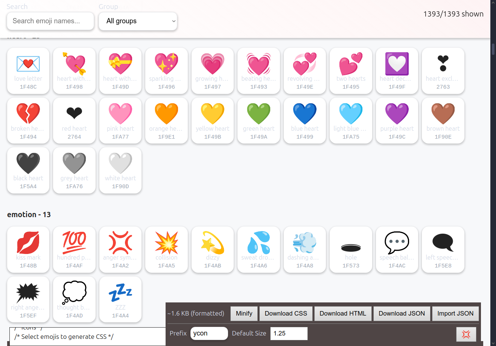

# Ycons - Emoji Icon Generator 🎨

**Icons for WebApps using Emojis** - A powerful browser-based tool for creating custom CSS icon systems using Unicode emojis.

This tool is self-contained HTML that runs instantly and offline in any modern browser, just using the `file://` protocol. No dependencies, no build steps, no server needed. You can download and run it from your download folder.

> **1,393 Unicode emojis available** | Generate lightweight CSS icon systems

## Preview

That's what to expect: Plain CSS. You can copy&paste it to your CSS, or download the generated CSS as file and link it to your HTML.

**No additional files, images, svgs, pngs, apis, endpoints, packages or else needed.**



The final icons are plain CSS, so basically text - no external files needed!


[Live example for the following on JSFiddle using: 😀](https://jsfiddle.net/zsoepy1f/)

But instead of the Emoji itself, we use Unicode identifiers (e.g., "\1F600"). That's the safest way to deliver Emojis in CSS for most browsers.

~~`.ycon-flexed-biceps::before { content: "\1F600"; }`~~

Renamed to (you can rename all, or none, it's your call):

`.ycon-ypsilon::before { content: "\1F600"; }`

```html
<!--
  General styles for Ycons - 😀
-->
<style>
.ycon {
    display: inline-block;
    vertical-align: middle;
    line-height: 1;
    font-size: 1.25rem;
    pointer-events: none;
    user-select: none;
}
.ycon::before { display: inline-block; }

/* Transform utilities */
.ycon.mirror { transform: scaleX(-1); }
.ycon.flip { transform: scaleY(-1); }
.ycon.mirror.flip { transform: scale(-1, -1); }
.ycon.rotate-90 { transform: rotate(90deg); }
.ycon.rotate-180 { transform: rotate(180deg); }
.ycon.rotate-270 { transform: rotate(270deg); }

/* Filter utilities */
.ycon.gray { filter: grayscale(1); }
.ycon.blur { filter: blur(1px); }
.ycon.dim { filter: brightness(0.7); }
.ycon.bright { filter: brightness(1.3); }
.ycon.sepia { filter: sepia(1); }
.ycon.invert { filter: invert(1); }
.ycon.saturate { filter: saturate(1.5); }
.ycon.desaturate { filter: saturate(0.5); }

/* Animation utilities */
.ycon.spin { animation: ycon-spin 2s linear infinite; }
.ycon.pulse { animation: ycon-pulse 2s ease-in-out infinite; }
.ycon.bounce { animation: ycon-bounce 1s ease-in-out infinite; }

/* Keyframes */
@keyframes ycon-spin {from {transform: rotate(0deg);} to {transform: rotate(360deg);}}
@keyframes ycon-pulse {0%, 100% {opacity: 1;} 50% {opacity: 0.5;}}
@keyframes ycon-bounce {
    0%, 20%, 50%, 80%, 100% { transform: translateY(0); }
    40% { transform: translateY(-10px); }
    60% { transform: translateY(-5px); }
}
/* Size variants */
.ycon-xxs { font-size: 1rem; }
.ycon-xs { font-size: 1.25rem; }
.ycon-sm { font-size: 1.5rem; }
.ycon-md { font-size: 1.75rem; }
.ycon-lg { font-size: 2rem; }
.ycon-xl { font-size: 2.5rem; }
.ycon-xxl { font-size: 3rem; }

/* Our renamed Ycon */
.ycon-ypsilon::before { content: "\1F600"; }
</style>
<!--
  Available variants, including sizes and modifiers.
  This is not part of the tool, but how to use Ycons.
-->
<span class="ycon ycon-ypsilon"></span>
<span class="ycon ycon-ypsilon ycon-xxs"></span>
<span class="ycon ycon-ypsilon ycon-xs"></span>
<span class="ycon ycon-ypsilon ycon-sm"></span>
<span class="ycon ycon-ypsilon ycon-md"></span>
<span class="ycon ycon-ypsilon ycon-lg"></span>
<span class="ycon ycon-ypsilon ycon-xl"></span>
<span class="ycon ycon-ypsilon ycon-xxl"></span>
<hr />
<span class="ycon ycon-ypsilon gray"></span>
<span class="ycon ycon-ypsilon dim"></span>
<span class="ycon ycon-ypsilon bright"></span>
<span class="ycon ycon-ypsilon sepia"></span>
<span class="ycon ycon-ypsilon invert"></span>
<span class="ycon ycon-ypsilon saturate"></span>
<span class="ycon ycon-ypsilon desaturate"></span>
<span class="ycon ycon-ypsilon blur"></span>
<span class="ycon ycon-ypsilon mirror"></span>
<span class="ycon ycon-ypsilon flip"></span>
<span class="ycon ycon-ypsilon rotate-90"></span>
<span class="ycon ycon-ypsilon spin"></span>
<span class="ycon ycon-ypsilon pulse"></span>
<span class="ycon ycon-ypsilon bounce"></span>
```

[Live demo with 131 icons (~8kb CSS) on JSFiddle](https://jsfiddle.net/wycsx647/)

## 🔄 Creative Loading Indicators

Spinning emojis make perfect themed loading indicators with personality:

```html
<!-- Classic spinners -->
<span class="ycon ycon-gear spin"></span>           <!-- ⚙️ Processing... -->
<span class="ycon ycon-cyclone spin"></span>        <!-- 🌀 Loading... -->
<span class="ycon ycon-arrows-counterclockwise spin"></span> <!-- ↺ Refreshing... -->

<!-- Creative themed loaders -->
<span class="ycon ycon-pizza spin"></span>          <!-- 🍕 Cooking your data -->
<span class="ycon ycon-cd spin"></span>             <!-- 💿 Loading playlist -->
<span class="ycon ycon-camera spin"></span>         <!-- 📷 Processing photos -->
```

**Pro tip:** Combine animations for extra attention (not included):
```html
<style>
.ycon.pulse.spin {
  animation:         ycon-pulse 2s ease-in-out infinite, ycon-spin 2s linear infinite;
  -webkit-animation: ycon-pulse 2s ease-in-out infinite, ycon-spin 2s linear infinite;
}
</style>
<span class="ycon ycon-hourglass-flowing-sand spin pulse"></span> <!-- ⏳ Double effect! -->
```

[Interactive loading indicators demo on JSFiddle](https://jsfiddle.net/hmjaw5vb/)

## 🚀 Quick Start

**✨ [Try Ycons Online](https://eypsilon.github.io/ycons/example/) ✨**

1. Open the live tool or download [`./example/index.html`](./example/index.html) (254kb)
   - Includes [emoji data](./scripts/emojis.json) (209kb)
2. Search or browse for emojis you want to use
3. Click emojis to select them
4. See live preview and generated CSS
5. Download your custom CSS file

## ✨ Features

### 🔍 **Live Emoji Browser**
- Browse 1,393 emojis from the official Unicode emoji set
- Real-time search by name, group, or category
- Filter by emoji groups (Smileys, People, Animals, etc.)
- Interactive selection with visual feedback

### 🎛️ **Customizable CSS Generation**
- **Configurable prefix** - Use any CSS class prefix (default: `ycon`)
- **Adjustable default size** - Set base font-size (default: 1.25rem)
- **Size variants** - 7 predefined sizes (xxs to xxl)
- **Transform utilities** - Mirror, flip, rotate transformations
- **Filter effects** - Grayscale, blur, brightness, sepia, invert, saturation
- **Animations** - Spin, pulse, bounce with CSS keyframes

### 📱 **Live Preview**
- Real-time preview of selected icons
- See all size variants and effects instantly
- Toggle effects visibility for cleaner view
- Interactive examples with tooltips

### 💾 **Export & Import**
- **Download CSS** - Get production-ready stylesheet (62-71kb for all icons)
- **Download HTML** - Complete demo page with selected icons (~1.3MB for all icons)
- **Minify option** - Compact CSS for smaller file sizes (~12% reduction)
- **Export JSON** - Save selected icons with metadata (~209kb for all icons)
- **Import JSON** - Restore previous selections
- **Size calculator** - See approximate file size in real-time

## 🎯 Usage Examples

### Basic Icon Usage
```html
<span class="ycon ycon-rocket"></span>
<span class="ycon ycon-heart"></span>
<span class="ycon ycon-star"></span>
```

### Size Variants
```html
<span class="ycon ycon-fire ycon-xs"></span>    <!-- Extra small -->
<span class="ycon ycon-fire ycon-sm"></span>    <!-- Small -->
<span class="ycon ycon-fire ycon-lg"></span>    <!-- Large -->
<span class="ycon ycon-fire ycon-xxl"></span>   <!-- Extra large -->
```

### Transform Effects
```html
<span class="ycon ycon-arrow-right mirror"></span>     <!-- Mirrored -->
<span class="ycon ycon-smiley flip"></span>            <!-- Flipped -->
<span class="ycon ycon-clock rotate-90"></span>        <!-- Rotated 90° -->
```

### Filter Effects
```html
<span class="ycon ycon-camera gray"></span>            <!-- Grayscale -->
<span class="ycon ycon-sun bright"></span>             <!-- Brightened -->
<span class="ycon ycon-crescent-moon dim"></span>      <!-- Dimmed -->
<span class="ycon ycon-old-key sepia"></span>          <!-- Sepia tone -->
```

### Animations
```html
<span class="ycon ycon-gear spin"></span>              <!-- Spinning -->
<span class="ycon ycon-beating-heart pulse"></span>    <!-- Pulsing -->
<span class="ycon ycon-basketball bounce"></span>      <!-- Bouncing -->
```

### Combining Classes
```html
<span class="ycon ycon-rocket ycon-lg spin bright"></span>
```

## 🛠️ Tool Features

### Search & Filter
- **Live search** - Type to find emojis instantly
- **Group filter** - Filter by emoji categories
- **Show selected** - View only your chosen icons
- **Smart filtering** - All filters work together

### CSS Customization
- **Prefix input** - Change CSS class prefix
- **Default size** - Adjust base icon size
- **Live updates** - See changes immediately
- **Minify toggle** - Switch between formatted/minified CSS

### Preview & Export
- **Live preview** - See exactly how icons will look
- **HTML download** - Generate complete demo pages
- **Size calculation** - Know your CSS file size
- **Fullscreen mode** - Distraction-free editing

## 📁 File Structure

```
ycons/
├── example/
│   ├── assets/
│   │   ├── favicon.ico
│   │   └── main.css          # 9kb - UI styles
│   └── index.html            # 254kb - Complete app
├── scripts/
│   ├── emoji-test.txt        # Unicode data source
│   ├── emojis.json           # 209kb - 1,393 processed emojis
│   └── parse-emojis.js       # Unicode data parser
└── README.md                 # This file
```

## 📊 Performance Data

**All 1,393 icons exported:**
- **CSS (formatted):** 71kb
- **CSS (minified):** 62kb (~12% smaller)
- **HTML demo page:** 1.3MB (includes embedded CSS + examples + Backup JSON)
- **JSON backup:** 209kb (metadata + Unicode mappings)
- **Total package:** ~1.7MB for complete icon system

## 🎨 Generated CSS Structure

The tool generates clean, organized CSS:

```css
/* Base styles */
.ycon {
    display: inline-block;
    vertical-align: middle;
    line-height: 1;
    font-size: 1.25rem;
    pointer-events: none;
    user-select: none;
}

/* Transform utilities */
.ycon.mirror { transform: scaleX(-1); }
.ycon.flip { transform: scaleY(-1); }
.ycon.rotate-90 { transform: rotate(90deg); }

/* Filter utilities */
.ycon.gray { filter: grayscale(1); }
.ycon.bright { filter: brightness(1.3); }

/* Animation utilities */
.ycon.spin { animation: ycon-spin 2s linear infinite; }
.ycon.pulse { animation: ycon-pulse 2s ease-in-out infinite; }

/* Size variants */
.ycon-xs { font-size: 1rem; }
.ycon-lg { font-size: 2rem; }

/* Icons */
.ycon-rocket::before { content: "\1F680"; }
.ycon-heart::before { content: "\2764"; }
```

## 💡 Use Cases

- **Web applications** - Add expressive icons without image files
- **Design systems** - Create consistent emoji-based iconography
- **Prototyping** - Quick icons for mockups and demos
- **Performance** - Lightweight alternative to icon fonts/SVGs
- **Accessibility** - Unicode emojis have built-in semantic meaning

## 🌟 Benefits

- **No dependencies** - Pure HTML/CSS/JavaScript
- **Lightweight** - Tiny file sizes compared to icon fonts
- **Scalable** - Vector-based emojis scale perfectly
- **Customizable** - Full control over styling and behavior
- **Cross-platform** - Works everywhere Unicode is supported
- **Future-proof** - Based on Unicode standard

## 🔧 Development

### Processing Emoji Data
```bash
cd scripts/
node parse-emojis.js
```

This processes the Unicode `emoji-test.txt` file into structured JSON data.

## 📜 License

Open source - feel free to use, modify, and distribute!


## 👥 **Authors**

- **Claude Van DOM** - Implementation and optimization
- **Engin Ypsilon** - Original concept and architecture

---

*Made with ❤️ for developers who love emojis* 🚀✨
